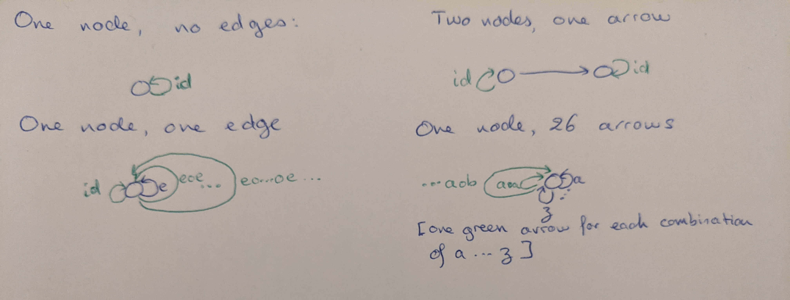

## 1

> Generate a free category from:
>  * A graph with one node and no edges
>  * A graph with one node and one (directed) edge (hint: this edge can be composed with itself)
>  * A graph with two nodes and a single arrow between them
>  * A graph with a single node and 26 arrows marked with the letters of the alphabet: a, b, c … z.

## 2

> What kind of order is this?
>  * A set of sets with the inclusion relation: A is included in B if every element of A is also an element of B.

This is a partial order.

>  * C++ types with the following subtyping relation: T1 is a subtype of T2 if a pointer to T1 can be passed to a function  that expects a pointer to T2 without triggering a compilation error.

I don't know much about C++, but I think this is also a partial order.

## 3

> Considering that Bool is a set of two values True and False, show that it forms two (set-theoretical) monoids with respect to, respectively, operator && (AND) and || (OR).

### &&

We need to check the monoid laws:

 * `&&` is associative, i.e. `a && (b && c) == a && b && c == (a && b) && c`,
 * `true` is a neutral element for `&&`, i.e. `a && true == true && a == a`

So `Bool` is a monoid with respect to `&&`.

### ||

Similarly, `Bool` is a monoid with respect to `||` because

 * `||` is associative, i.e. `a || (b || c) == (a || b) || c`,
 * `false` is a neutral element, i.e. `a || false == false || a == a`.

## 4

> Represent the Bool monoid with the AND operator as a category: List the morphisms and their rules of composition.

The morphisms are:
 * `id`
 * `Kfalse`, the function that always returns false

All compositions are obvious.
 
## 5

> Represent addition modulo 3 as a monoid category.

The morphisms are:
 * `id`
 * `+1`
 * `+2`
 
The composition rules are:
 * composing anything with `id` follows `id` rules
 * `+1 ∘ +1 == +2`
 * `+2 ∘ +2 == +1`
 * `+1 ∘ +2 == +2 ∘ +1 == id`
