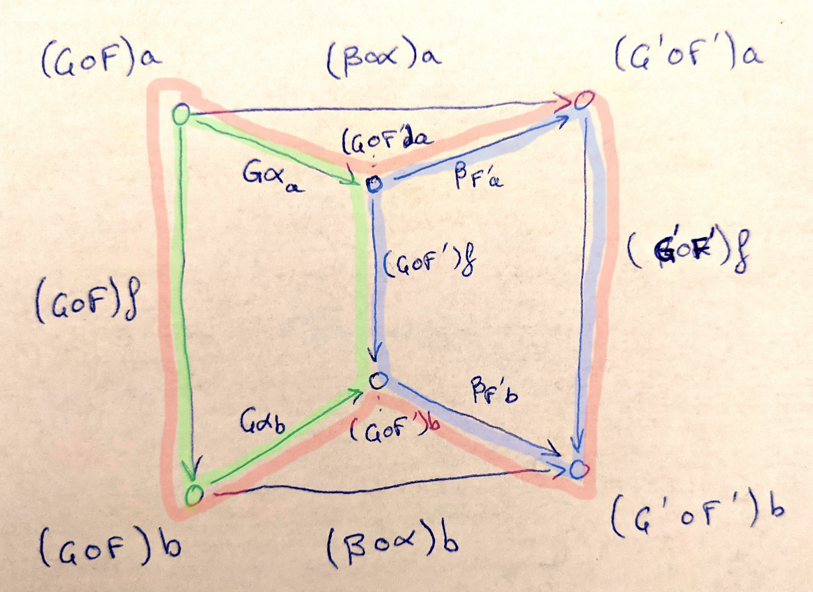

## 1

> Define a natural transformation from the `Maybe` functor to the list functor. Prove the naturality condition for it.

Because of parametric polymorphism, we know that any function

```haskell
alpha :: Maybe a -> [a]
```

satisfies the naturality condition. The simplest such `alpha` is probably

```haskell
alpha Nothing = []
alpha (Just a) = [a]
```

## 2

> Define at least two different natural transformations between `Reader ()` and the list functor. How many different lists of `()` are there?

Two examples are 

```haskell
alpha1 :: Reader () a -> [a]
alpha1 f = [f ()]
```

and

```haskell
alpha2 :: Reader () a -> [a]
alpha2 _ = []
```

There are infinitely many lists of `()` (they are `[]`, `[()]`, `[(), ()]`, etc.), we can define infinitely many natural transformations that discard their `Reader ()` argument like `alpha2`.

## 3

> Continue the previous exercise with `Reader Bool` and `Maybe`.

```haskell
alpha1 :: Reader Bool a -> Maybe a
alpha1 f = Nothing
alpha2 f = Just (f true)
alpha3 f = Just (f false)
```

## 4

> Show that horizontal composition of natural transformation satisfies the naturality condition (hint: use components). It’s a good exercise in diagram chasing.

We want to show <i>(α ∘ β)_b ∘ (G ∘ F) f = (G' ∘ F') f ∘ (α ∘ β)_a</i>.

Let's take a look at this diagram:



We want to prove that the outer square (uncolored) commutes. First, observe that by definition of _(α ∘ β)_, the red-marked square is equal to the outer square. So we need to prove that the red square commutes from _(G ∘ F) a_ to _(G' ∘ F') b_.

Next, We know (by naturality condition on α) that <i>α_b ∘ F f = F' f ∘ α_a</i>. Since _G_ is a functor, it preserves composition, and we have <i>G α_b ∘ (G ∘ F) f = (G ∘ F') f ∘ G α_a</i>. This means that the green square commutes.

The blue square commutes, because it represents the naturality condition of _β_ at _F' a_.

Finally, the blue and green square together form the red square; because they both commute, so does the red square. (This is easy to verify, or see e.g. [this proof](https://math.stackexchange.com/a/2879124/).

## 5

> Write a short essay about how you may enjoy writing down the evident diagrams needed to prove the interchange law.

Coming soon

## 6

> Create a few test cases for the opposite naturality condition of transformations between different Op functors. Here’s one choice:

```haskell
op :: Op Bool Int
op = Op (\x -> x > 0)
```

> and

```haskell
f :: String -> Int
f x = read x
```

Recall the definition of `Op`:

```haskell
newtype Op r a = Op (a -> r)
instance Contravariant (Op r) where
    contramap f (Op g) = Op (g . f)
```
For any transformation we define, we must check it preserves the opposite naturality condition:

```haskell
contramap f . transformation = transformation . contramap f
```

Let's define a transformation:

```haskell
transformation :: Op Bool a -> Op Int a
transformation (Op g) = \x -> if (g x) then 1 else 0
```

We can now check:

```haskell
assert contramap f . transformation = transformation . contramap f
```
